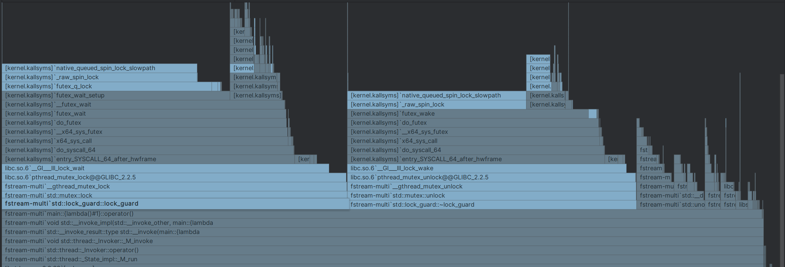
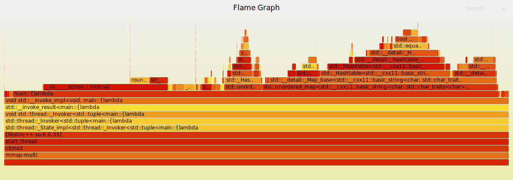
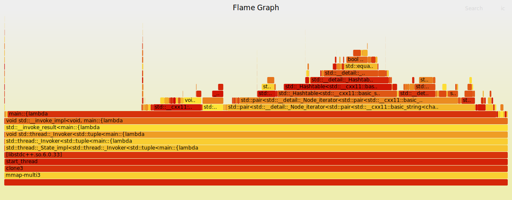

# 使用c++完成1brc挑战

挑战：
https://1brc.dev

[github]https://github.com/gunnarmorling/1brc
仓库issue里可以找到数据库生成代码。


## baseline

没有任何优化 5m52s
编译器选项 -O3 -march=native -g0 -DNDEBUG -fomit-frame-pointer 3m0.391s


## 先看看用cpp fstream读要多久

fstream 似乎不太占用内存。

```c++
#include <fstream>
#include <iostream>

int main() {
    std::fstream file;
    file.open("example.txt", std::ios::out); // 以输出模式打开文件

    if (!file) {
        std::cerr << "Unable to open file!" << std::endl;
        return 1; // 文件打开失败
    }

    file << "Hello, World!" << std::endl; // 写入文本
    file.close(); // 关闭文件

    return 0;
}
```
使用fstream以流式打开文件，不会把整个文件读到内存中， 而是逐行读取。每次只读取一行内容，处理完后释放内存。

先写一个[单线程版本](./fstream-simple.cpp)，仅仅读数据和向map里存kv。
结果似乎也没有那么慢，带着log才4分钟左右。
```
Time taken: 238642 milliseconds
```

## mmap实现

使用mmap去映射文件，然后通过遍历方式读取，结果好像更慢了。


## 瓶颈分析

使用CLion的profiler工具进行性能分析，发现单线程主要的瓶颈点在哈希表的读取上。


## 访存优化

每个线程分配一个map，主线程最后汇总各map数据。
每个map 提前reserve(1000)减少扩容消耗。 
该[版本](./fstream-multi.cpp)多线程9分46秒完成. 性能分析发现哈希表已经不再是最主要的瓶颈，fstream的锁反而是瓶颈了。
火焰图如下：

由于多个线程同时要读取ifstream，但文件流不是线程安全的，多个线程共享ifsteam需要加锁，因此会有开销，这里可以选择使用mmap优化文件读取.

mmap是一个能将文件映射到虚拟内存，从而用指针直接访问的api。

```c++
void *mmap(void *addr, size_t length, int prot, int flags, int fd, off_t offset);
/*
addr：指定映射的起始地址。如果为 NULL，则由操作系统自动选择一个地址。
length：指定映射的长度。
prot：指定映射区域的保护方式。可以是以下几种值的组合：
    PROT_READ：可读。
    PROT_WRITE：可写。
    PROT_EXEC：可执行。
flags：指定映射区域的标志。可以是以下几种值的组合：
    MAP_SHARED：与其他进程共享映射区域。
    MAP_PRIVATE：不与其他进程共享映射区域。
    MAP_FIXED：指定映射区域的起始地址。如果指定了这个标志，则 addr 参数必须为非 NULL。
    MAP_ANONYMOUS：不映射任何文件，而是映射一段匿名的内存区域。
fd：指定要映射的文件描述符。
offset：指定要映射的文件的偏移量。
*/
```

这里prot设置为PROT_READ，flag应该设置MAP_PRIVATE，只读文件，且不与其他进程共享。

现在的思路是：将文件mmap到内存中，多个线程同时在文件的不同位置开始处理。这样可以避免fstream的锁竞争问题，因为fstream目前只能从一个起点开始。不过有几个问题要搞清楚：

1. 文件映射到内存后，是不是真的已经在物理内存中了，还是会通过缺页再去加载？
2. 要不同线程同时开始访问，需要怎么初始化每个线程的指针？
3. 线程的指针如果没有在一条记录的开始处怎么解决？

这些问题要在代码中逐一解决。
1. mmap映射到内存后返回起始指针`char *mapped`，然后通过文件描述符`fd`和`fstat`函数获取文件大小`file_size`，然后就可以使用`mapped[i]`方式访问文件中的内容。文件并不是一次性放入物理内存，而是通过缺页中断，通过分配物理页、读入文件数据、建立页表映射，然后才能访问。
2. 线程指针初步定为将文件大小平均分，但这样的问题可能会导致**内存抖动**问题。后续再研究
3. 这里的方案是在开始时，先为指针找到下一个`'\n'`作为开始，同时该位置是上个线程的结束点。

这样优化后能达到2m18秒水平,相对之前的10m多是一个比较大的进步。

最新的火焰图显示瓶颈回归到了map上。



## hash表使用优化和double优化

### hash表优化 
优化程序的很重要的一条就是减少copy次数。在原有的程序中，在unordered_map的使用上有问题。

```c++
if (stations.find(name) == stations.end()) {
    stations[name] = WeatherStation();
}
stations[name].cnt += 1;
stations[name].id = name;
stations[name].totalTemp += t;
stations[name].maxTemp = max(stations[name].maxTemp, t);
stations[name].minTemp = min(stations[name].minTemp, t);
```

优化版：

```c++
auto [it, inserted] = stations.try_emplace(string(buf));
auto& st = it->second;
st.cnt += 1;
st.totalTemp += t;
st.maxTemp = std::max(st.maxTemp, t);
st.minTemp = std::min(st.minTemp, t);
++k;
```

其中主要的优化在使用`try_emplace`减少哈希查找次数, 旧版本`stations[name]`每次都会产生一次查找，性能较低。

### 数据类型优化

原始使用`atof`函数转换字符数组为double类型，但计算机浮点运算速度要比整数运算慢很多（因为浮点数表示复杂、需要特殊指令和运算单元FPU），同时这里的数据都是小数点后1位，可以直接转换成整数，输出结果乘0.1即可。（需要注意负号）

完整的代码在[mmap-multi3.cpp](./mmap-multi3.cpp)

优化后性能又一次明显提高到`0m23.417s`.

火焰图



仍然存在的问题：
1. 哈希表的[]运算符开销比较大
2. 各个线程结束时间不同，有的线程很快就完成然后空闲。

## map优化【正确性待定】

再会看代码发现哈希表的使用是无意义的。最后要得到的数据是有序的，也就是说还要把存储在哈希表里的数据赋值到map里，hash表只起到一个收集数据的作用，但它引入的开销确非常大。

而且我们完全可以省略哈希表，直接把数据存储到map里即可。但这么做不是没有代价的，代价就是所有k都要在map里做查找，1b的key查询尽管是logn，但也不会特别快。

初步实现放在[nohashmap](./mmap_nohashmap.cpp)里，但结果并不理想，5m38s。其中从文件中读取并写入数组耗时大概2m8s。观察内存占用发现虽然一开始分配了足够多的虚拟内存，但实际物理内存访问的时候还是一点一点增长。这就是操作系统对内存的“懒分配”，大规模顺序读写的情况下，很容器触发大量page fault，造成延迟提高。而且pair的存储造成了大量的copy，也加剧了消耗。最后1b元素添加到map里还是很慢。

这里优化的方法还是mmap预先分配，并设置flag为`MAP_POPULATE`, 告知系统立刻分配物理页，在这个过程中OS会分配物理页并清零，代价是初始化时间较长，但后续访问速度会更快。

但注意一点，vector里存储的是`pair<string, double>`，这里有个问题就是string不是定长类型，而是动态分配的，和vector差不多。存储string不可避免要发生copy，不必要的copy也是很大的内存消耗。

虽然string可以通过定长数组存储，但这里为了避免复制，直接使用指针存比较好。这样数组的元素是`[const char*, uint8_t len, double]`的三元组形式，单元素大小4+1+4=9B 最好放一个struct，对齐到16B.

